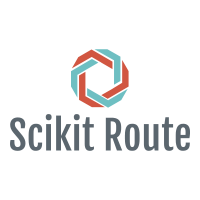
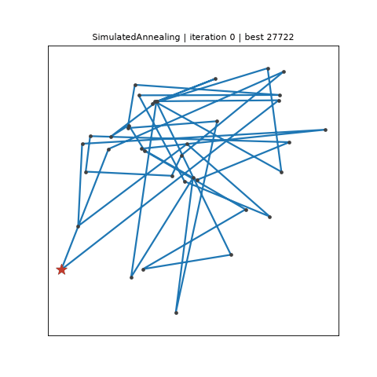

<p align="center">
  
</p>

<p align="center">
  <a href="https://github.com/arubiales/scikit-route/actions/workflows/ci.yml"></a>
  <a href="https://arubiales.github.io/scikit-route/"></a>
  <a href="https://pypi.org/project/scikit-route/"></a>
  
  <a href="LICENSE"></a>
</p>

**scikit-route** is a Python library of route-optimisation solvers with the API you
already know from scikit-learn: build an estimator, call `fit`, read the result from
trailing-underscore attributes. It solves the classic travelling salesman problem
(symmetric or asymmetric) and a **multi-trip** variant in which a worker returns to
the depot whenever a trip would exceed a working-time budget, paying a fixed charge
per extra trip. Every solver evaluates costs and neighbourhood moves in a shared
**Cython** core, so the same code handles 30 nodes in microseconds and 10 000 nodes
in seconds.

Exact methods (brute force, Held–Karp, a MILP on HiGHS), construction heuristics
(nearest neighbour, insertion, Clarke–Wright savings, NRBS), local search (2-opt,
Or-opt, iterated local search) and metaheuristics (simulated annealing, tabu search,
genetic algorithm, ant colony, self-organising map) share one problem object, one set
of fitted attributes and one test battery.

## Installation

```bash
pip install scikit-route
```

Wheels are published for CPython 3.11–3.14 on Linux (x86_64, aarch64), macOS
(x86_64, arm64) and Windows (AMD64) with every `v*` tag. Until the 2.0.0 release is on
PyPI, install the development version from GitHub (a C compiler is needed):

```bash
pip install "git+https://github.com/arubiales/scikit-route.git@modernization/v2"
```

Optional extras:

| extra    | adds                                                      |
|----------|-----------------------------------------------------------|
| `pandas` | `DataFrame` inputs and outputs (`as_frame=True` loaders)  |
| `google` | the Google Distance Matrix client                         |
| `viz`    | matplotlib: `plot_route`, `LivePlot`, `Recorder` (GIFs)   |
| `viz-map`| + plotly: OpenStreetMap tiles and the plotly live backend |
| `test`   | pytest, hypothesis, pandas                                |
| `docs`   | MkDocs Material and mkdocstrings                          |
| `dev`    | everything above plus ruff, mypy, cython-lint, pre-commit |

Installing from source needs a C compiler and Cython >= 3.1 (`pip install -e .`).

## Thirty seconds

```python
>>> # 1. Plain TSP from numpy: Western Sahara, optimum 27603 -- labels are the file's 1-based ids
>>> from skroute import IteratedLocalSearch
>>> from skroute.datasets import load_tsp
>>> wi = load_tsp("wi29")                       # TSPBunch: coords, labels, depot, optimal_tour_length, ...
>>> C = wi.distance_matrix()                    # metric="tsplib_euc_2d": nint rounding, optima match the literature
>>> ils = IteratedLocalSearch(random_state=0).fit(C, labels=wi.labels)   # route_ comparable with the published tour
>>> ils.cost_ / wi.optimal_tour_length < 1.03   # the fast-tier tolerance of the test-suite
True
>>> int(ils.route_[0]) == int(ils.route_[-1]) == int(ils.depot_) == 1
True
>>> ils.n_iter_ == len(ils.history_) and ils.stop_reason_ in {"patience", "max_iter"}
True

```

```python
>>> # 2. Multi-trip from Barcelona: 8-hour days, 12.83 EUR per extra day, two people.
>>> # Loader matrices are PLAIN ndarrays: pass labels=bcn.labels, otherwise depot=bcn.depot is not a label of X.
>>> import numpy as np
>>> from skroute import SimulatedAnnealing, TabuSearch, RoutingProblem
>>> from skroute.datasets import load_barcelona
>>> bcn = load_barcelona()                      # cost (EUR), time (h), labels (int64 ids), depot == 10000007
>>> sa = SimulatedAnnealing(random_state=0).fit(bcn.cost, time_matrix=bcn.time, labels=bcn.labels,
...                                             depot=bcn.depot, max_time_work=8.0, extra_cost=12.83, people=2)
>>> bool(np.all(sa.trip_times_ <= 8.0))          # every trip fits, return leg included
True
>>> int(sa.route_[0]) == int(sa.route_[-1]) == 10000007 and sa.n_trips_ == len(sa.trips_)
True
>>> problem = RoutingProblem(bcn.cost, time_matrix=bcn.time, labels=bcn.labels, depot=bcn.depot,
...                          max_time_work=8.0, extra_cost=12.83, people=2, split="optimal")
>>> costs = {type(est).__name__: est.fit(problem).cost_ for est in (sa, TabuSearch(random_state=0))}
>>> sorted(costs)                                 # one instance, several solvers, optimal split
['SimulatedAnnealing', 'TabuSearch']

```

```python
>>> # 3. Legacy dict-of-dicts input; the depot is the first key, as 1.0's route_example[0]. Deterministic: exact output.
>>> from skroute import BruteForce
>>> cost = {1: {1: 0, 2: 5, 3: 9, 4: 10}, 2: {1: 5, 2: 0, 3: 4, 4: 8},
...         3: {1: 9, 2: 4, 3: 0, 4: 3}, 4: {1: 10, 2: 8, 3: 3, 4: 0}}
>>> hours = {1: {1: 0, 2: 1, 3: 2, 4: 2}, 2: {1: 1, 2: 0, 3: 1, 4: 2},
...          3: {1: 2, 2: 1, 3: 0, 4: 1}, 4: {1: 2, 2: 2, 3: 1, 4: 0}}
>>> bf = BruteForce().fit(cost, time_matrix=hours, max_time_work=4.0, extra_cost=3.0)
>>> bf.route_.tolist(), bf.cost_, bf.n_trips_
([1, 2, 3, 1, 4, 1], 41.0, 2)

```

Every solver accepts a numpy array, a pandas `DataFrame` (its index provides the
labels) or a dict of dicts; asymmetric matrices are treated as an asymmetric TSP.
The result is always recomputed from the returned tour, so `cost_` and `route_`
agree by construction.

## Which solver?

<!-- capability-table:start -->
| Solver | Kind | Exact | Stochastic | Multi-trip aware | Asymmetric | Needs coordinates | Max nodes |
|---|---|---|---|---|---|---|---|
| `AntColony` | metaheuristic | no | yes | yes | yes | no | — |
| `BruteForce` | exact | yes | no | yes | yes | no | 11 |
| `ClarkeWright` | construction | no | no | yes | no | no | — |
| `EnsembleGenetic` | ensemble | no | yes | yes | yes | no | — |
| `EnsembleSimulatedAnnealing` | ensemble | no | yes | yes | yes | no | — |
| `Genetic` | metaheuristic | no | yes | yes | yes | no | — |
| `HeldKarp` | exact | yes | no | no | yes | no | 20 |
| `Insertion` | construction | no | no | no | yes | no | — |
| `IteratedLocalSearch` | local search | no | yes | yes | yes | no | — |
| `LocalSearch` | local search | no | no | yes | yes | no | — |
| `MILP` | exact | yes | no | no | yes | no | 300 |
| `NRBS` | construction | no | no | no | yes | no | — |
| `NearestNeighbour` | construction | no | no | no | yes | no | — |
| `OrOpt` | local search | no | no | yes | yes | no | — |
| `SOM` | metaheuristic | no | yes | no | yes | yes | — |
| `SimulatedAnnealing` | metaheuristic | no | yes | yes | yes | no | — |
| `TabuSearch` | metaheuristic | no | yes | yes | yes | no | — |
| `TwoOpt` | local search | no | no | yes | yes | no | — |
<!-- capability-table:end -->

`IteratedLocalSearch` is the recommended default: it reaches the published optimum on
the small bundled instances and stays within a few percent on the 1 000-node ones.
Use `MILP` (or `BruteForce` below 12 nodes) when you need a certificate of optimality,
and `SimulatedAnnealing`, `TabuSearch` or `Genetic` when the multi-trip budget matters
and you want to trade time for quality. `MultiStart` runs any stochastic solver from
several seeds in parallel and keeps the best result.

## Watch the search

Every solver accepts `fit(..., callback=)`; `skroute.viz` (extra `viz`, matplotlib) turns
that into a live picture of the search — the attempt the solver is working on (thin), the
best tour so far (thick), the structure it is building when it reports one (the growing
tour of a construction heuristic, the pheromone trails of the ant colony, the SOM ring)
and its own facts, redrawn while `fit` runs — or a recording of it: `Recorder` replays a
run at time-lapse speed, saves it as a GIF or MP4, or gives a Plotly figure with
Play/Pause, a speed menu and a slider (`viz-map` adds OpenStreetMap tiles):

<p align="center">
  
</p>

```python
>>> from skroute import SimulatedAnnealing
>>> from skroute.datasets import load_tsp
>>> from skroute.viz import LivePlot, Recorder
>>> dj = load_tsp("dj38")
>>> live = LivePlot(dj.coords, every=10)  # the attempts (thin) and the best (thick), redrawn as fit runs
>>> sa = SimulatedAnnealing(random_state=0).fit(dj.distance_matrix(), labels=dj.labels, callback=live)  # doctest: +SKIP
>>> rec = Recorder(every=10)  # or keep every event, with its clock...
>>> sa = SimulatedAnnealing(random_state=0).fit(dj.distance_matrix(), labels=dj.labels, callback=rec)  # doctest: +SKIP
>>> rec.replay(dj.coords, speed=10)  # ...and watch the run again, ten times faster  # doctest: +SKIP
>>> rec.save("dj38.gif", dj.coords, speed=10)  # or write the time-lapse (an .mp4 with ffmpeg)  # doctest: +SKIP

```

## Real-world planning

The 2.1 release closes the loop from the map to the map. `skroute.preprocessing.maps` asks
OpenStreetMap for the stops (`fetch_pois`), Nominatim or Google for an address (`geocode`)
and OSRM or Google for the road travel times (`travel_time_matrix`); `fit(...,
service_time=)` accounts for the time spent at each stop, `skroute.metrics.timetable` turns
a fit into clock times, and `skroute.viz.google_maps` exports the plan as Google Maps
Directions links, a KML for Google My Maps or a Maps JavaScript page. The worked case
[*A real case: the technician's plan*](https://arubiales.github.io/scikit-route/user_guide/real_world/)
— `examples/technician_madrid.py` — schedules one alarm-systems technician over the 182
Burger King restaurants of the Madrid region from an office in Leganés, thirty minutes per
visit and eight-hour days on real OSRM driving times: **15 days and 25.8 hours of
driving** against the 16 days of the construction heuristics (12 is the service-only lower
bound), reproducible offline from the CSVs committed under `examples/data/`.

## Documentation

- [User guide, API reference and benchmarks](https://arubiales.github.io/scikit-route/)
- [Migrating from 1.0](https://arubiales.github.io/scikit-route/migration/) — 2.0 is a
  rewrite: `fit` takes the cost matrix and returns `self`, problem data moved from
  `__init__` to `fit`, and four hard dependencies are gone.
- [Contributing](CONTRIBUTING.md), [Code of conduct](CODE_OF_CONDUCT.md),
  [Security policy](SECURITY.md), [Changelog](CHANGELOG.md)

## Citation

If scikit-route helps your work, cite it through the repository's `CITATION.cff`
(GitHub → *Cite this repository*).

## License

MIT — see [LICENSE](LICENSE). The bundled national TSP instances come from the
[University of Waterloo collection](https://www.math.uwaterloo.ca/tsp/world/countries.html)
by William Cook and colleagues; the file format is TSPLIB by Gerhard Reinelt.
