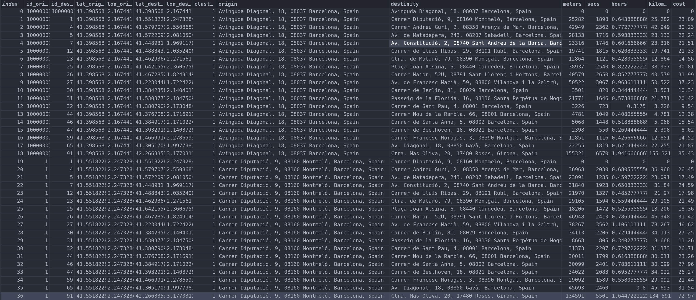

# Dataset

The dataset module are some datasets builded and adapted to the package algorithms. The purpose is to have a fast and easy understunding of the package, how the algorithms works, what kind of data is required and in wich format. 

The data are different Datasets wich have the main info needed for the algorithm (not all the information is needed for every algorithm). The columns are:

* *id_origin* and *id_destinity*: point id that connect other point id
* *lat_origin*, *lon_origin*, *lat_destinity*, *lon_destinity*: The same as above, but with latitude and longitude
* *origin* and *destinity*: The same as above but with the address
* *meters*: distance in meters from the *id_origin* to the *id_destinity*
* *secs*: distance in sec from the *id_origin* to the *id_destinity*
* *hours*: distance in hours from the *id_origin* to the *id_destinity*
* *kilometers*: distance in kilometers from the *id_origin* to the *id_destinity*
* *cost*: fuel cost, this is computation of the hours multiply for the cost per hour, and the fuel cost needed for make the route.



There are differents datasets you can import and load easy, one time it's loaded the data can be adapted with the preprocessing module if it's required. The datasets are ```Pandas DataFrame``` objects

```
from sklear_route.dataset import load_alicante_murcia
from sklear_route.dataset import load_barcelona
from sklear_route.dataset import load_madrid
from sklear_route.dataset import load_valencia
from sklearn.preprocessing import matrix_to_dict

#Loading distinct datasets
df_alicante_murcia  = load_alicante_murcia()
df_barcelona = load_barcelona()
df_madrid = load_madrid()
df_valencia = load_valencia()

#Converting a dataset to a diagonal symmetric matrix dict of dicts
cost_matrix = matrix_to_dict(df_barcelona, "id_origin", "id_destinity", "hora")
```