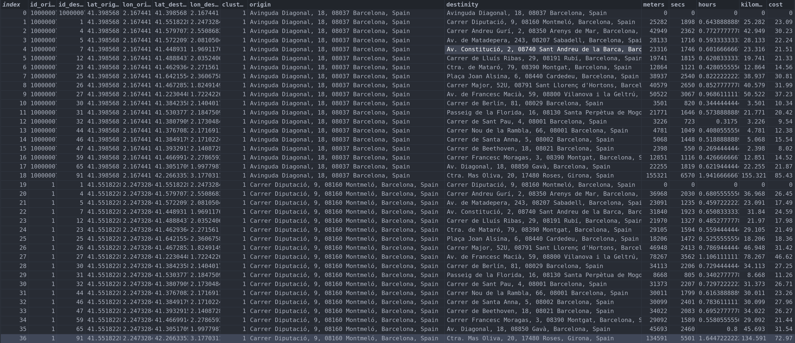
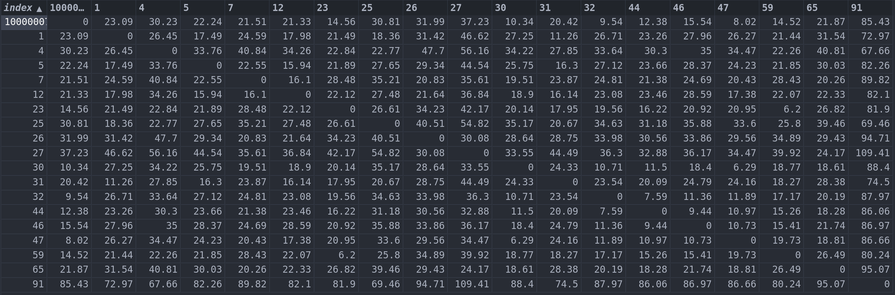

#Preprocessing

The preprocessing module could be confused if it's compared with the Scikit Learn Preprocessing module. In this case this module is not a Mathematical module for preprocesing data, it's a module oriente to preprocesed data in order to feed the algorithms, wich means that it's not make it with mathematical purposes only with structure purposes.

The different functions of the preprocessing module are:

## matrix_to_dict

```matrix_to_dict```: is a function that convert a diagonal matrix with origins -> destiny points from a dataframe to a dicts of dicts. This dict of dict is needed for the ```Genetic``` algorithm and the ```EnsembleGenetic``` algorithm in order to compute their results. The parameters of the function are:

* ```dataframe```: the dataframe that will be converted
* ```id_origin```: the name of the column with the id of the origin points 
* ```id_destinity```: the name of the column with the id of the destinity points
* ```compute_column```: the column data that will be taken in order to create the data of the diagonal matrix

We have the following Dataframe (Barceloa dataframe from datasets):


Use example:

```
from sklearn_route.datasets import load_barcelona
from sklearn_route.preprocessing import matrix_to_dict

#Dataset - id of origin - id of destiny - column to transform (in this case the hour)
time_matrix = matrix_to_dict(df_barcelona, "id_origin", "id_destinity", "hora")

#Dataset - id of origin - id of destiny - column to transform (in this case the cost)
cost_matrix = matrix_to_dict(df_barcelona, "id_origin", "id_destinity", "hora")
```

So the dict of dicts represent a diagonal matrix. it's transformed in a dict of dicts for performance reasons. Only for learning purpose we will represent the dict of dicts as a diagonal matrix:

```
import pandas as pd

df = pd.DataFrame(cost_matrix_df)
```

And the result:



This matrix represent the cost of go from one point (origin id) to other (destinity id). This cost is computed with the hours and the cost of fuel per kilometer.