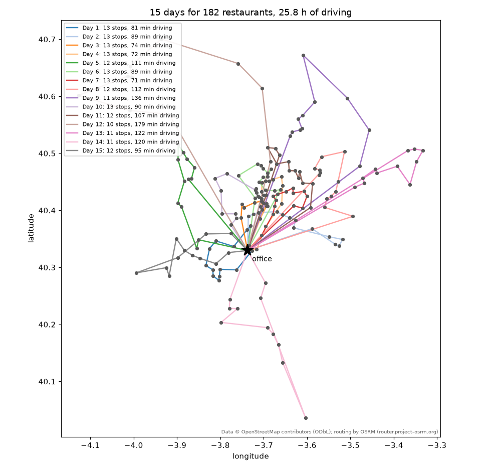
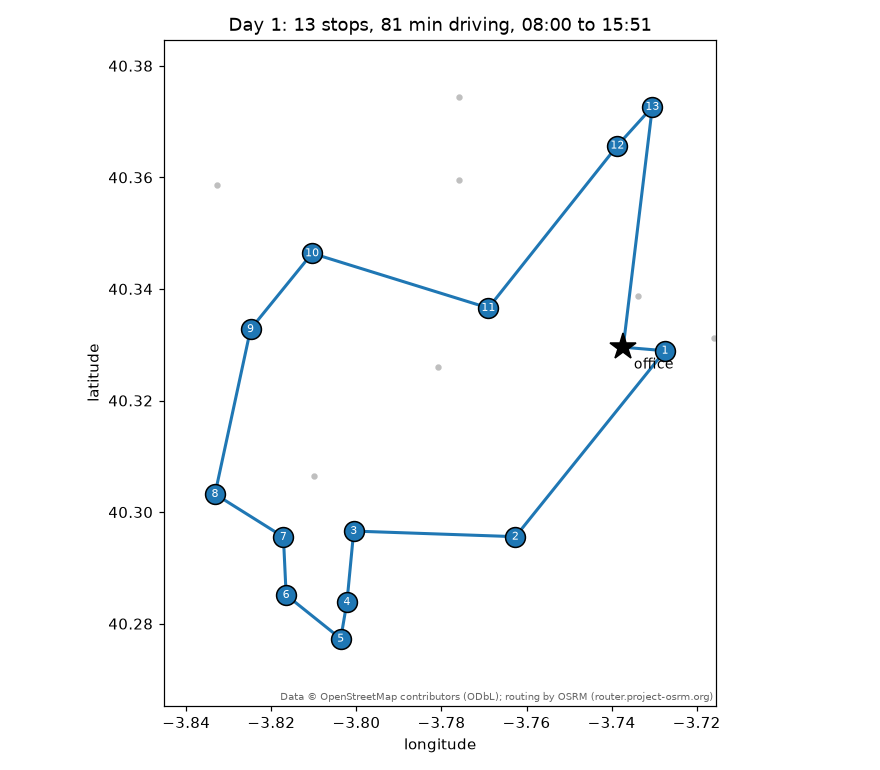

# A real case: the technician's plan

The owner of the library set the problem in his own words:

> *Imaginemos que tenemos que hacer los mantenimientos de los Burger King de Madrid y
> nuestra oficina está en Leganés en Calle Ramón y Cajal 18. Un mantenimiento medio tarda
> 30 min. Quiero ver todas las rutas como serían para cubrir todos los Burger King por un
> técnico de mantenimiento de sistemas de alarma día tras día hasta que los haga todos, lo
> más óptimo posible. Su jornada es de 8 horas.*

Every Burger King of the Madrid region, one alarm-systems technician, thirty minutes per
visit, eight-hour days starting and ending at an office in Leganés, and the plan should be
as good as possible: as few days as it takes, with as little driving as possible — on real
road travel times, and shown on Google Maps. This page walks through the case with the
2.1 tools; the script that produces every number and picture below is
`examples/technician_madrid.py`, and the data it used are committed under
`examples/data/` so that you can rerun it offline in two minutes.

<p align="center">
  
</p>

## The data: three calls to map services

The 182 restaurants come from OpenStreetMap through the Overpass API
([`fetch_pois`][skroute.preprocessing.fetch_pois]): every element tagged
`amenity=fast_food` with the brand's Wikidata id `Q177054` inside the administrative
area *Comunidad de Madrid*, with ways and relations (restaurants mapped as buildings)
placed at their centre. The office is geocoded with Nominatim
([`geocode`][skroute.preprocessing.geocode]), and the public OSRM demo server gives the
driving times and distances between all 183 points
([`travel_time_matrix`][skroute.preprocessing.travel_time_matrix]) — 16 table requests of
50 × 50 blocks, twenty seconds with the polite pauses. The whole pipeline, as the script
runs it under `--refresh`:

```python
>>> import numpy as np
>>> from skroute.preprocessing import fetch_pois, geocode, haversine_matrix, travel_time_matrix
>>> bk = fetch_pois("Comunidad de Madrid", amenity="fast_food", wikidata="Q177054")  # doctest: +SKIP
>>> D = haversine_matrix(bk.coords) * 1000  # doctest: +SKIP
>>> keep = [i for i in range(len(bk.labels)) if not (D[i, :i] < 60).any()]  # a way and its node: one restaurant  # doctest: +SKIP
>>> office = geocode("Calle Ramón y Cajal 18, Leganés, Madrid, España")  # doctest: +SKIP
>>> round(office.lat, 6), round(office.lon, 6)  # doctest: +SKIP
(40.329559, -3.73727)
>>> coords = np.vstack([[office.lat, office.lon], bk.coords[keep]])  # doctest: +SKIP
>>> labels = ["office", *(bk.labels[i] for i in keep)]  # doctest: +SKIP
>>> roads = travel_time_matrix(coords)  # OSRM: minutes and metres, asymmetric  # doctest: +SKIP
>>> T = roads.time  # doctest: +SKIP

```

The capture of 2026-09-05 gave 183 elements, one of them a near-duplicate within 60 m
(the same restaurant as a building and as a point) that the script drops. Those files are
what the rest of this page loads — the code below runs against the repository as it is, from
its root (the paths are relative to it):

```python
>>> import csv
>>> from pathlib import Path
>>> data = Path("examples/data")
>>> with open(data / "madrid_burger_king.csv", encoding="utf-8", newline="") as fh:
...     rows = list(csv.DictReader(fh))
>>> labels = [r["label"] for r in rows]
>>> coords = np.array([[float(r["lat"]), float(r["lon"])] for r in rows])
>>> T = np.loadtxt(data / "madrid_burger_king_times_min.csv", delimiter=",", skiprows=1, usecols=range(1, 184))
>>> len(labels), labels[0], T.shape, round(float(T[0, 1:].mean()), 1), round(float(np.abs(T - T.T).max()), 1)
(183, 'office', (183, 183), 22.5, 10.0)
>>> sum(1 for r in rows[1:] if any(r[c] for c in ("city", "street", "housenumber", "postcode")))
56
>>> sum(1 for r in rows[1:] if r["opening_hours"])
24

```

Seven restaurants in ten have no `addr:*` tag in OpenStreetMap (56 of the 182 carry an
address), so the timetable names most stops "Burger King" plus their OSM id; the coordinates are what matters to the solver. With a
Google Maps key the same script fetches the matrix from the Distance Matrix API instead
(`--provider google --google-key ...`), with `departure_time="now"` for traffic-aware
durations — OSRM has no traffic model.

!!! note "Attribution"
    Data © OpenStreetMap contributors (ODbL); routing by OSRM (router.project-osrm.org).
    Show it wherever these numbers or pictures appear.

## The model: a trip is a working day

The [multi-trip objective](multi_trip.md) maps onto the case without any new concept:

| In the owner's words | In `fit` |
|---|---|
| the driving between restaurants | `X = T`, the driving minutes — the objective is total driving |
| an eight-hour day | `time_matrix=T`, `max_time_work=480` |
| thirty minutes per maintenance | `service_time=30` (paid on arrival at every restaurant, nothing at the office) |
| "día tras día hasta que los haga todos" | one trip per day; `extra_cost=480` charges a full day of driving per extra day, so a plan with fewer days always beats a plan with less driving |
| "lo más óptimo posible" | `split="optimal"`: the giant tour is cut into days by Prins' shortest path, never worse than the greedy cut |
| the technician starts and ends at the office | `depot="office"`, the first row |

Twelve is the floor: 182 visits × 30 min = 91 h of service alone, and a day holds eight,
so no plan has fewer than 12 days — and 12 would need every day packed with 15 or 16
visits and next to no driving. The construction heuristics, which ignore the budget while
they build the tour and are priced afterwards, give the first feeling of the instance:

```python
>>> import warnings
>>> from skroute import Insertion, NearestNeighbour
>>> spec = dict(time_matrix=T, labels=labels, depot="office", coords=coords,
...             service_time=30.0, max_time_work=480.0, extra_cost=480.0, split="optimal")
>>> with warnings.catch_warnings():
...     warnings.simplefilter("ignore")  # "ignores max_time_work during its search", by design
...     nn = NearestNeighbour().fit(T, **spec)
...     ins = Insertion().fit(T, **spec)
>>> (nn.n_trips_, round(float(nn.trip_costs_.sum()))), (ins.n_trips_, round(float(ins.trip_costs_.sum())))
((16, 1844), (16, 1721))

```

Sixteen days and 29–31 hours behind the wheel. [`ClarkeWright`][skroute.ClarkeWright], the
budget-aware construction, refuses the OSRM matrix because one-way streets and motorway
exits make it asymmetric (up to ten minutes between the two directions of a pair); a
symmetrised copy gets it to 16 days and 1669 minutes on the copy — 1660 on the real
matrix — which is still a construction, not a search:

```python
>>> from skroute import ClarkeWright
>>> ClarkeWright().fit(T, **spec)
Traceback (most recent call last):
    ...
ValueError: ClarkeWright requires a symmetric cost matrix
>>> S = (T + T.T) / 2
>>> cw = ClarkeWright().fit(S, **dict(spec, time_matrix=S))
>>> cw.n_trips_, round(float(cw.trip_costs_.sum()))
(16, 1669)

```

## The search: relocations, priced with the optimal split

At 183 nodes an [`IteratedLocalSearch`][skroute.IteratedLocalSearch] iteration under
`split="optimal"` is expensive — every candidate move is priced with the O(n L) shortest
path of the optimal split — and the objective is a staircase: a day costs 480 minutes of
driving, so between two plans with the same number of days only the driving moves, and
the step down to one day fewer needs several coordinated relocations, each of which
alone adds a few minutes of driving and is refused by a descent. Three things were tried
on this instance, each with eight restarts of [`MultiStart`][skroute.MultiStart] in
parallel processes and two minutes of wall clock:

- the default move set (2-opt then Or-opt, candidate lists of 10) under the optimal split:
  16 days and about 1 570 minutes of driving, 60–70 iterations per restart;
- a search under `split="greedy"` (twenty times cheaper per iteration, a thousand of them
  per restart) followed by a re-pricing and polish of the winner under `split="optimal"`:
  16 days and 1 551 minutes — the optimal cut of a tour is never worse than its greedy
  cut, but a tour tuned for the greedy decoding does not pack into 15 days;
- **Or-opt alone, candidate lists of 5, under the optimal split**: 15 days in three of the
  eight restarts, 1 557 minutes for the best of them, 250 iterations per restart.

Relocating a segment of one to three stops is the move that repacks a day; 2-opt reverses
a stretch of the tour, which shortens the driving inside a day but rarely changes what
fits into it, and costs the iterations Or-opt needs. So the script searches with Or-opt
only for 85 % of the budget and then polishes the winner for the remaining 15 % with the
full move set — a descent from the winning tour that keeps the best tour seen, so it can
only gain: here it took another eight minutes of driving off.

```python
>>> from skroute import IteratedLocalSearch, MultiStart
>>> fit = dict(time_matrix=T, labels=labels, depot="office", coords=coords,
...            service_time=30.0, max_time_work=480.0, extra_cost=480.0, split="optimal")
>>> search = MultiStart(
...     IteratedLocalSearch(n_iter=10**6, patience=None, time_limit=102, local_search=("or_opt",), n_candidates=5),
...     n_restarts=8, n_jobs=-1, prefer="processes", random_state=0,
... )
>>> search.fit(T, **fit)  # doctest: +SKIP
MultiStart(...)
>>> search.n_trips_, round(float(search.trip_costs_.sum()))  # doctest: +SKIP
(15, 1557)
>>> plan = IteratedLocalSearch(init=search.tour_, n_iter=10**6, patience=None, time_limit=18, random_state=0)  # doctest: +SKIP
>>> plan.fit(T, **fit)  # doctest: +SKIP
IteratedLocalSearch(...)
>>> plan.n_trips_, round(float(plan.trip_costs_.sum()))  # days, minutes of driving  # doctest: +SKIP
(15, 1549)

```

`prefer="processes"` matters here: the multi-trip kernels hold the interpreter lock while
they price a move, so threads — the default, right for the plain TSP — run the restarts
one at a time at this size. The time limits make the run irreproducible bit for bit; the
numbers below are those of one run on the machine that wrote this page (10 cores,
`--time-limit 120`, 123 s in all), and `python examples/technician_madrid.py` on yours
will land within a few minutes of driving of them — and, in a run with less luck, on 16
days: give it `--time-limit 300` to make 15 the rule. `--quick` replaces the budget with a
few deterministic iterations for the test suite.

## The result: 15 days

Fifteen days — three more than the service-only floor, one fewer than every
construction heuristic — and 1 549 minutes of driving, 25.8 hours over the fortnight, 103
minutes a day. Against the plans of the constructions that is 294 minutes less driving than
`NearestNeighbour` and 172 less than `Insertion`, on top of the day saved. The technician
visits 12.1 restaurants a day on average: 13 on the seven days spent in the dense centre of
Madrid and the south-western belt around the office, 10 to 12 on the days that reach the
far ends of the region — Aranjuez in the south, Alcalá de Henares in the east, the towns of
the Sierra to the north-west — where two to three hours go to the road.

[`timetable`][skroute.metrics.timetable] turns the fit into clock times from 08:00 and
[`timetable_summary`][skroute.metrics.timetable_summary] into the table below, which the
script writes as `technician_madrid_days.csv` — plus the kilometres of each day, summed over
the distance matrix — (and every stop, with its arrival and departure, as
`technician_madrid_timetable.csv`):

```python
>>> from skroute.metrics import timetable, timetable_summary
>>> days = timetable(plan, start="08:00")  # doctest: +SKIP
>>> for row in timetable_summary(days):  # doctest: +SKIP
...     print(row["day"], row["n_stops"], round(row["driving"]), row["back_at"])
1 13 81 15:51
2 13 89 15:59
3 13 74 15:44
4 13 72 15:42
5 12 111 15:51
6 13 89 15:59
7 13 71 15:41
8 12 112 15:52
9 11 136 15:46
10 13 90 16:00
11 12 107 15:47
12 10 179 15:59
13 11 122 15:32
14 11 120 15:30
15 12 95 15:35

```

| Day | Stops | Driving | Service | Back at the office |
|---|---|---|---|---|
| 1 | 13 | 81 min | 390 min | 15:51 |
| 2 | 13 | 89 min | 390 min | 15:59 |
| 3 | 13 | 74 min | 390 min | 15:44 |
| 4 | 13 | 72 min | 390 min | 15:42 |
| 5 | 12 | 111 min | 360 min | 15:51 |
| 6 | 13 | 89 min | 390 min | 15:59 |
| 7 | 13 | 71 min | 390 min | 15:41 |
| 8 | 12 | 112 min | 360 min | 15:52 |
| 9 | 11 | 136 min | 330 min | 15:46 |
| 10 | 13 | 90 min | 390 min | 16:00 |
| 11 | 12 | 107 min | 360 min | 15:47 |
| 12 | 10 | 179 min | 300 min | 15:59 |
| 13 | 11 | 122 min | 330 min | 15:32 |
| 14 | 11 | 120 min | 330 min | 15:30 |
| 15 | 12 | 95 min | 360 min | 15:35 |

Every day ends between 15:30 and 16:00: the longest is day 10, back at 16:00 exactly, with
13 stops and 90 minutes of driving — a full eight hours to the minute — and the shortest,
day 14, is back at 15:30 after 11 stops and two hours on the road. The first day, zoomed in
with its stops numbered in visiting order:

<p align="center">
  
</p>

Day 1 stays around the office: it leaves at 08:00, is at the first restaurant three minutes
later, works its way through Leganés, Fuenlabrada and Alcorcón — thirteen visits, at most
ten minutes or so between two of them — and is back at 15:51 with 81 minutes of driving in
the day. The per-stop timetable (`technician_madrid_timetable.csv`) reads, for
its first stops:

| Day | Order | Stop | Arrival | Departure | Travel | Service |
|---|---|---|---|---|---|---|
| 1 | 0 | Oficina (Calle Ramón y Cajal 18, Leganés) | 08:00 | 08:00 | 0.0 | 0.0 |
| 1 | 1 | Burger King (node/13457640691) | 08:03 | 08:33 | 2.6 | 30.0 |
| 1 | 2 | Burger King (way/1156068846) | 08:43 | 09:13 | 10.3 | 30.0 |
| 1 | 3 | Burger King (node/1092878580) | 09:21 | 09:51 | 8.4 | 30.0 |
| … | | | | | | |
| 1 | 7 | Burger King, Calle del Oasis 2, 28942 Fuenlabrada | 11:37 | 12:07 | 3.6 | 30.0 |
| … | | | | | | |
| 1 | 13 | Burger King (node/5602005239) | 15:12 | 15:42 | 3.6 | 30.0 |
| 1 | 14 | Oficina (Calle Ramón y Cajal 18, Leganés) | 15:51 | 15:51 | 9.1 | 0.0 |

## The plan on Google Maps

Three exports of the same fitted estimator, none needing matplotlib, put the plan in the
technician's hands ([`skroute.viz.google_maps`](../api/viz.md)):

**Directions links** — [`google_maps_urls`][skroute.viz.google_maps_urls] gives one list
of URLs per day; Google's URL scheme takes nine intermediate stops, so a day of 13
visits is two consecutive legs that share their boundary stop. Each link opens in the
browser or in the Google Maps app with turn-by-turn navigation. The script writes them as
`technician_madrid_google_urls.txt`, one line per leg with the day.

```python
>>> from skroute.viz import google_maps_urls
>>> urls = google_maps_urls(plan)  # doctest: +SKIP
>>> len(urls), [len(day) for day in urls][:3]  # doctest: +SKIP
(15, [2, 2, 2])
>>> urls[0][0][:80]  # doctest: +SKIP
'https://www.google.com/maps/dir/?api=1&origin=40.329559%2C-3.737270&destination='

```

**A KML for Google My Maps** — [`to_kml`][skroute.viz.to_kml] writes one folder per day
("Día 1", "Día 2"...) with numbered placemarks and the day's line, each day in its own
colour. To see it on a phone: open [google.com/maps/d](https://www.google.com/maps/d/),
*Create a new map*, then in the untitled layer choose *Import* and pick
`technician_madrid.kml` — every folder becomes a group of numbered pins with its line, the
map is saved to the account and opens in the Google Maps app under *Saved → Maps*. Google
Earth opens the same file with *File → Open* (desktop) or *Projects → Import KML file*
(web).

```python
>>> from skroute.viz import to_kml
>>> names = {label: f"Burger King {label}" for label in labels}  # the script uses the OSM address when there is one
>>> trip_names = [f"Día {k}" for k in range(1, plan.n_trips_ + 1)]  # doctest: +SKIP
>>> to_kml(plan, path="technician_madrid.kml", names=names,
...        depot_name="Oficina (Calle Ramón y Cajal 18, Leganés)", trip_names=trip_names)  # doctest: +SKIP
PosixPath('technician_madrid.kml')

```

**The real roads, in a page** — with a Maps JavaScript API key,
[`google_maps_html`][skroute.viz.google_maps_html] writes a standalone page that asks the
Directions service for every leg and draws the roads of each day in its colour, with
numbered markers, a legend with a checkbox per day and the totals (stops, driving
minutes) computed here and embedded as JSON. `python examples/technician_madrid.py
--google-key AIza...` (or `GOOGLE_MAPS_API_KEY` in the environment) writes it as
`technician_madrid_google.html`; the key ends up in the page, so share the file
accordingly, and the Directions requests are billed to the key's project. Without a key,
the interactive alternative is [`plot_route_map`][skroute.viz.plot_route_map] on
OpenStreetMap tiles (Plotly), which the script always writes as
`technician_madrid_map.html` with the restaurant names on hover and the days in a legend:

```python
>>> from skroute.viz import google_maps_html, plot_route_map
>>> google_maps_html(plan, path="technician_madrid_google.html", api_key="AIza...",
...                  names=names, trip_names=trip_names, title="Burger King maintenance plan")  # doctest: +SKIP
PosixPath('technician_madrid_google.html')
>>> fig = plot_route_map(plan, names=names, trip_names=trip_names)  # doctest: +SKIP
>>> fig.write_html("technician_madrid_map.html")  # doctest: +SKIP

```

## Running it yourself

```bash
python examples/technician_madrid.py                       # the committed data, two minutes, ./technician_madrid_out
python examples/technician_madrid.py --time-limit 600      # ten minutes: a few more minutes of driving saved
python examples/technician_madrid.py --service 45 --hours 9 --start 07:30
python examples/technician_madrid.py --solver sa --live    # watch SimulatedAnnealing work on it
python examples/technician_madrid.py --refresh             # today's restaurants and roads (OSM, Nominatim, OSRM)
```

`--refresh` rewrites the three CSVs from the live services (the OSRM demo server, or
Google with `--provider google`); expect the count of restaurants to have moved. The
options are listed in `examples/README.md`.

## Assumptions and limits

The plan is as good as its model, and the model makes assumptions worth stating:

- **Travel times are static.** The OSRM matrix is the free-flow estimate of the road
  network at the moment of the capture (2026-09-05): no rush hour, no roadworks, no
  weather. The Google provider with `departure_time="now"` gives traffic-aware durations
  for the moment you ask, which is still one snapshot. A day whose return is scheduled at
  15:5x has some slack; one at 16:00 has none.
- **No lunch break, no buffer.** The eight hours are driving plus service; a half-hour
  break either comes out of the budget (`--hours 7.5`) or out of the technician's evening.
  Thirty minutes is an *average* maintenance: a long one shifts every later stop of that
  day, and a very long one spills into the next day. Per-restaurant durations are one
  array away (`service_time=` accepts one value per node).
- **Every restaurant is open when the technician arrives.** The `opening_hours` tag is in
  the data for one restaurant in eight (24 of the 182) and is not used; the model has no time windows
  yet (`Stop.wait` is reserved for them).
- **The list is OpenStreetMap's.** It may miss a restaurant nobody has mapped, keep one
  that has closed, or hold the same one twice (the script drops near-duplicates within
  60 m, so two real restaurants closer than that would collapse into one). A restaurant
  mapped as a building is placed at the centre of that building, which can be a few tens
  of metres from its door; OSRM snaps every point to the nearest road, so a restaurant
  inside a shopping centre is timed to the road outside.
- **One technician, one vehicle, from the office every morning.** Every day starts and
  ends at Calle Ramón y Cajal 18; a technician who lives on the far side of Madrid, or two
  technicians sharing the list (`people=2` multiplies the charge per extra day, and each
  trip becomes one person-day), is a different plan.
- **The optimum is not certified.** `MultiStart(IteratedLocalSearch)` is a heuristic; the
  bound of 12 days is a counting argument, not a proof that 13 or 14 are impossible. More
  time (`--time-limit 600`) or more restarts shave minutes of driving, and any run with the
  time limit lands near — not exactly on — the numbers above.

The numbers, the tables and the pictures of this page were produced by
`examples/technician_madrid.py` on the committed data. Data © OpenStreetMap contributors
(ODbL); routing by OSRM (router.project-osrm.org).
