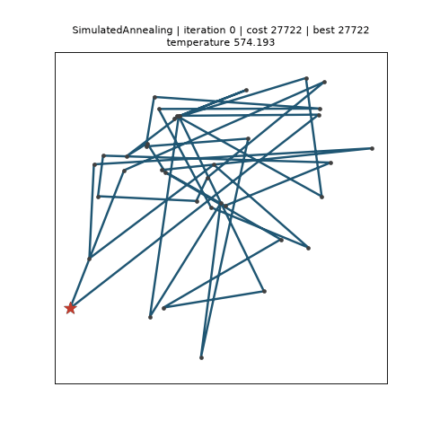
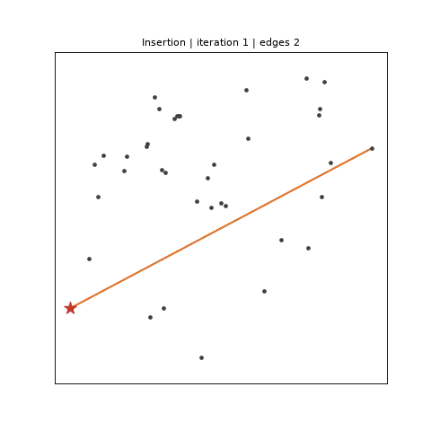
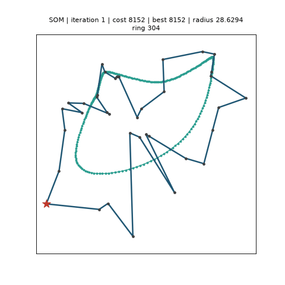

# Live visualisation

Route optimisation is a spatial problem, and a solver's progress is easiest to judge by
eye: are the crossings disappearing, is the best tour still changing, did the annealer
freeze too early? `skroute.viz` draws the answer — a fitted solution as a static picture,
a running solver **live**, and a finished run **again, at time-lapse speed** — through
the `fit(..., callback=)` protocol every solver implements: the solver hands a
`RouteEvent` to your callback at the start of the search, after every outer iteration
(or every construction step) and at the end; [`LivePlot`][skroute.viz.LivePlot] redraws
the attempt, the best tour and the structure being built on each event,
[`Recorder`][skroute.viz.Recorder] keeps them, with their clock, for later.

<p align="center">
  
</p>

The pictures on this page are produced by the code of the repository:
`examples/live_demo.py --record` writes them (the exact commands are given under each).

## Installing

The package is optional and nothing else in scikit-route imports it:

```bash
pip install "scikit-route[viz]"       # matplotlib: plot_route, plot_history, LivePlot, Recorder
pip install "scikit-route[viz-map]"   # + plotly: OpenStreetMap tiles, the plotly backend, sliders
```

`import skroute.viz` needs neither library — matplotlib and plotly are loaded at the
first call — and a missing one raises an `ImportError` naming the extra to install.

Coordinates are always `(n, 2)` arrays in the row order of the cost matrix. The
matplotlib tools draw column 0 as x and column 1 as y; the map tools expect
`(latitude, longitude)`. For geographic data on plain axes pass `coords[:, ::-1]`.

## A picture of a solution

[`plot_route`][skroute.viz.plot_route] takes a fitted estimator and draws the nodes,
the depot (a star) and the closed route, one colour per trip; the coordinates come from
`fit(..., coords=)` or from its `coords=` argument. [`plot_history`][skroute.viz.plot_history]
draws `history_`, the best-so-far cost per outer iteration.

```python
>>> import matplotlib
>>> matplotlib.use("Agg")  # this page runs headless; drop the line on a desktop
>>> from skroute import IteratedLocalSearch
>>> from skroute.datasets import load_tsp
>>> from skroute.viz import plot_history, plot_route
>>> dj = load_tsp("dj38")  # Djibouti, 38 cities, optimum 6656
>>> ils = IteratedLocalSearch(random_state=0).fit(dj.distance_matrix(), labels=dj.labels, coords=dj.coords)
>>> ax = plot_route(ils)
>>> len(ax.lines), len(ax.lines[0].get_xdata())  # one closed trip through the 38 cities
(1, 39)
>>> ax.get_title().startswith("IteratedLocalSearch | cost ")
True
>>> ax = plot_history(ils)
>>> len(ax.lines[0].get_ydata()) == ils.n_iter_
True

```

A multi-trip solution gets one line per trip. `plot_route` also accepts a route array
whose entries index the rows of `coords` (the `tour_` or `route_` of a solver fitted
without `labels=`; a repeated depot separates trips) and any `RouteEvent`:

```python
>>> import numpy as np
>>> xy = np.array([[0.0, 0.0], [1.0, 0.0], [1.0, 1.0], [0.0, 1.0]])
>>> ax = plot_route([0, 1, 0, 2, 3], xy, labels=True)  # two trips: 0-1-0 and 0-2-3-0
>>> len(ax.lines), [t.get_text() for t in ax.texts]
(2, ['0', '1', '2', '3'])

```

## Watch a run live

[`LivePlot`][skroute.viz.LivePlot] is a callable: pass it as the `callback` of `fit`.
On the `"start"` event it opens the figure; on every `every`-th `"iteration"` event it
redraws the **current** tour — the attempt the solver is working on — as a thin light
line and the **best** tour so far as a thick one, and puts the solver, the iteration,
both costs and one fact of the solver's own — its most informative scalar: the
temperature of an annealer, the tenure of a tabu search... — in the title; on `"end"` it
draws the final route with trip colours. It refreshes the window with `plt.pause`, so it
never blocks and never calls `plt.show()` — add that yourself after `fit` to keep the
window open.

```python
>>> import matplotlib.pyplot as plt
>>> from skroute import SimulatedAnnealing
>>> from skroute.viz import LivePlot
>>> live = LivePlot(dj.coords, every=10)  # redraw every tenth temperature level
>>> sa = SimulatedAnnealing(random_state=0).fit(
...     dj.distance_matrix(), labels=dj.labels, callback=live
... )  # doctest: +SKIP
>>> plt.show()  # doctest: +SKIP

```

`show=` picks what to draw during the run — `"both"` (the default), `"best"` alone, or
`"current"` alone — and `trail=k` keeps the last `k` attempts on screen, fading with age,
which gives a sense of where the search has been:

```python
>>> attempts = LivePlot(dj.coords, every=5, show="current", trail=8)  # the walker and its eight last steps
>>> attempts.show, attempts.trail
('current', 8)

```

A redraw costs a few milliseconds and a fast solver emits thousands of outer iterations
per second, so `every=` is the knob that keeps the search fast: `SimulatedAnnealing` runs
about 1 800 levels, `IteratedLocalSearch` up to `n_iter` kicks, `TabuSearch` `n_iter`
moves. Headless machines work too — on the `Agg` backend the lines are updated on every
kept iteration and the picture is rendered once, at `"end"`, without being shown, which is
how this page and the test-suite run.

The figure stays open after `fit` (close it with `plt.close(live.fig)` when you watch many
runs in one script), and the same `LivePlot` can watch the next fit: a new `"start"` opens
a fresh figure. Under `MultiStart(..., n_jobs=1)` the inner solvers' events are forwarded,
so every restart is drawn from scratch in the same figure and its final route stays on
screen until the next restart begins.

`examples/live_demo.py` in the repository wraps this in a small command line:

```bash
python examples/live_demo.py --instance dj38 --solver IteratedLocalSearch
python examples/live_demo.py --instance barcelona --solver SimulatedAnnealing --every 10 --show current --trail 5
```

### In a notebook

The same object works in Jupyter. `LivePlot` detects the kernel and picks the refresh
that fits the matplotlib backend:

- `%matplotlib inline` (the default) — every redraw replaces the cell output through
  `IPython.display.display(fig, clear=True)`, and the figure is closed after the last
  one, so the cell ends with a single picture; keep `every=` generous, each redraw
  renders a PNG.
- `%matplotlib widget` (ipympl) — the canvas is updated in place, the way a desktop
  window is.
- `LivePlot(coords, backend="plotly")` — a Plotly `FigureWidget` displayed once and
  updated in place; `map=True` puts it on OpenStreetMap tiles (and selects this backend
  by itself). Needs
  `scikit-route[viz-map]` and `anywidget` (Plotly's widget dependency); without a
  kernel the plotly backend builds a plain `Figure` and shows it once at `"end"`.

```python
>>> live = LivePlot(dj.coords, backend="plotly", every=5)  # doctest: +SKIP
>>> IteratedLocalSearch(random_state=0).fit(dj.distance_matrix(), labels=dj.labels, callback=live)  # doctest: +SKIP

```

## Replay at time-lapse speed

[`Recorder`][skroute.viz.Recorder] draws nothing while the solver runs; it copies every
event (`every=` thins the iterations) together with the wall clock at which it arrived,
and replays the run afterwards — as fast or as slow as you like. The deterministic descent
below has three events; a real run has hundreds:

```python
>>> from skroute import TwoOpt
>>> from skroute.viz import Recorder
>>> C = np.array([[0, 5, 9, 10], [5, 0, 4, 8], [9, 4, 0, 3], [10, 8, 3, 0]], dtype=float)
>>> rec = Recorder()
>>> two = TwoOpt().fit(C, coords=xy, callback=rec)
>>> [e.stage for e in rec.events], rec.n_frames
(['start', 'iteration', 'end'], 3)
>>> bool(np.all(np.diff(rec.timestamps) >= 0))  # the recorded clock, in seconds
True

```

Four ways to play it back:

- **`replay`** drives a `LivePlot` through the recorded events on the recorded clock
  divided by `speed`: `rec.replay(coords, speed=10)` shows a 30-second run in three
  seconds, in a window or a notebook, as it looked live — the time a redraw takes is
  absorbed by the waits that follow, a gap over two seconds is cut down to two, and where
  nothing is shown before `"end"` (the `Agg` backend) the events are drawn back to back.
  It returns the `LivePlot` (so `live.fig` holds the final picture); `every=`, `show=`,
  `trail=` and the other `LivePlot` options pass through.
- **`animate`** builds the same frames as a matplotlib `FuncAnimation`: `plt.show()`
  plays it, `IPython.display.HTML(anim.to_jshtml())` embeds it in a notebook. With
  `speed=` (the default, `1.0`, is real time) every frame waits its recorded gap divided
  by `speed`, clipped to `[10, 2000]` ms so a burst of iterations never flashes past and a
  slow step never freezes the replay (the floor is per frame: a run denser than a hundred
  kept frames per replayed second stretches rather than speeds up — thin it with
  `Recorder(every=)`); `fps=` plays one frame per kept event at a fixed rate instead;
  `interval=` fixes the delay in milliseconds; `hold=` is the pause on the final picture
  before the loop restarts. `rec.frame_delays(speed=...)` returns the per-frame delays in
  milliseconds.
- **`save`** writes the animation: a `.gif` through pillow, an `.mp4` (or any format
  ffmpeg writes) through matplotlib's ffmpeg writer — a clear `RuntimeError` names ffmpeg
  when it is missing. `fps=` is the frame rate of the file; `speed=` turns it into a
  time-lapse (each frame is held for its recorded gap divided by `speed`, clipped to
  `[10, 2000]` ms like `frame_delays` and rounded to whole frames; a GIF folds repeated
  frames, so the time-lapse costs no extra bytes); the coordinates default to those of
  the fit.
- **`to_plotly`** gives a figure with one frame per kept event, Play/Pause buttons, a
  speed menu — 0.5x, 1x, 2x, 4x and 8x of `fps` — and a slider over the iterations;
  `map=True` puts it on OpenStreetMap tiles.

```python
>>> live = rec.replay(xy, speed=1e9)  # no waiting at that speed: the three events, drawn in turn
>>> live.n_events, len(live.ax.lines) - 4  # after the four fixed artists: the final route, one trip
(3, 1)
>>> rec.frame_delays(speed=1e9).tolist()  # microsecond gaps at 1e9x: clipped to the 10 ms floor
[10.0, 10.0, 10.0]
>>> anim = rec.animate(xy, speed=10)  # doctest: +SKIP
>>> plt.show()  # doctest: +SKIP
>>> rec.save("descent.gif", xy, fps=20, speed=10)  # a 10x time-lapse GIF  # doctest: +SKIP
>>> rec.save("descent.mp4", xy, fps=30)  # ffmpeg on the PATH  # doctest: +SKIP
>>> fig = rec.to_plotly(xy)
>>> [b.label for b in fig.layout.updatemenus[1].buttons]
['0.5x', '1x', '2x', '4x', '8x']
>>> len(fig.frames) == rec.n_frames and [b.label for b in fig.layout.updatemenus[0].buttons]
['Play', 'Pause']
>>> fig.write_html("descent.html")  # doctest: +SKIP

```

Every frame is drawn the way `LivePlot` draws a live event — the attempt thin, the best
tour thick, the structures of the next two sections when the solver reports them, the
status line as the title, the final route with trip colours at `"end"` — and `show=`
chooses the tours (`"both"`, `"best"`, `"current"`) in `replay`, `animate`, `save` and
`to_plotly` alike.

`rec.events` holds the copies (`stage`, `iteration`, `cost`, `best_cost`, `tour`,
`best_tour`, `extra`, `timestamp`, a reference to the problem, and the decoded `route` and
`trips` like a live event); `rec.costs`, `rec.best_costs`, `rec.iterations` and
`rec.timestamps` are the same facts as arrays. A frame is drawn for every kept event that
carries something to draw — a tour, a best tour, edges or a ring — so `Recorder(every=30)`
on an 1 800-level annealing gives about 60 frames. A recorder accumulates — handed to a
second `fit` it appends that run's events — so build one per run you want to replay; the
events of a `MultiStart(n_jobs=1)` (one `"start"`/`"end"` per restart, `extra["restart"]`)
are plotted against the iteration counted across the restarts and labelled
`restart:iteration` on the slider.

The GIF at the top of this page is `SimulatedAnnealing(init="random", random_state=0)`
on Djibouti (`dj38`) recorded every 30 levels and saved at 80 dpi: a random tour of about
27 700 — four times the optimum 6656 — is untangled down to the optimum on the machine
that recorded it (another platform's `exp` may flip a Metropolis decision and land within
a percent of it); the annealer's attempts are the thin grey line, the best tour so far the
thick one:

```bash
python examples/live_demo.py --instance dj38 --solver SimulatedAnnealing --init random --every 30 \
    --record docs/images/live_demo.gif --fps 12
```

## See the route being built

Construction heuristics have no tour until they finish — and the interesting part is how
they get there. Under D31 they emit one `"iteration"` event per construction step with
`tour=None`, `cost=nan`, `best_cost=nan` and `extra["edges"]`, the `(label, label)` pairs
of the partial structure they hold: the growing path of `NearestNeighbour`, the partial
cycle of `Insertion` after each insertion, the current trips of `ClarkeWright` after each
merge, the edge set of `NRBS` after each connection, the LP support of `MILP` after each
cut round. `LivePlot` and `Recorder` draw those edges as orange segments — with no tour to
show, the edges *are* the picture — and `plot_route` draws a single step (`MILP` also
reports `edge_weights`, the LP value of each support edge, so its support is drawn as the
weighted trails of the next section):

<p align="center">
  
</p>

```python
>>> from skroute.base import RouteEvent
>>> labels = dj.labels
>>> partial = [labels[0], labels[7], labels[3]]  # the depot and the first two cities inserted
>>> cycle = list(zip(partial, partial[1:] + partial[:1]))  # the closed partial cycle: three edges
>>> step = RouteEvent("Insertion", "iteration", 2, np.nan, np.nan, None, None, ils.problem_, {"edges": cycle})
>>> ax = plot_route(step)
>>> len(ax.lines), len(ax.lines[0].get_xdata()), ax.get_title()  # one line, x0, x1, nan per edge
(1, 9, 'Insertion | 3 edges')

```

The GIF is `Insertion()` (farthest insertion) on `dj38`, one frame per inserted city — a
construction runs in a millisecond, so the file is written at a fixed frame rate rather
than as a time-lapse:

```bash
python examples/live_demo.py --instance dj38 --solver Insertion --record docs/images/construction_demo.gif --fps 8
```

## Pheromone trails and the SOM ring

Two more `extra` keys describe structures that are not tours. `AntColony` reports
`extra["edge_weights"]`, floats in `[0, 1]` parallel to `extra["edges"]` — the pheromone
strength of its `3n` strongest trails after each iteration — which `LivePlot` and
`Recorder` draw under the tours as segments whose width and opacity grow with the weight,
so the strong trails stand out and the weak ones fade (Plotly, which cannot vary the width
along a trace, draws at one width the trails whose weight reaches a quarter of the
strongest one's — `MILP`'s fractional edges included). `SOM` reports
`extra["ring"]`, an `(m, 2)` array with the positions of its neurons in the units of
`problem.coords` after each epoch, drawn as a closed teal polyline with small markers —
the elastic ring closing on the cities while the decoded tour (thin) and the best epoch's
tour (thick) follow it:

<p align="center">
  
</p>

```bash
python examples/live_demo.py --instance dj38 --solver SOM --set n_iter=20000 --record docs/images/som_demo.gif --fps 12
```

Viewers ignore keys they do not know, and an event without a key clears that drawing, so
a callback of your own can carry any structure through `extra` and still be drawn by the
three tools when it uses these names. The status line counts them: `edges 37`, `ring 304`.

## Stop a run interactively

Any callback that returns `True` asks the solver to stop after its current outer
iteration; the fit then completes normally with `stop_reason_ == "callback"` and the
best tour found so far. `LivePlot.stop()` arms exactly that, for the run in progress (a
later fit with the same `LivePlot` starts unarmed).

Redraws happen on the thread that runs `fit`, and matplotlib is not thread-safe — the
reason `MultiStart` forwards the callback to its inner estimators only with `n_jobs=1`.
With a desktop window (macosx, Tk, Qt) `fit` therefore stays on the main thread and the
stop comes from the window itself: connect a key handler once the figure exists.

```python
>>> live = LivePlot(dj.coords, every=5)
>>> def watch(event):
...     stop = live(event)
...     if event.stage == "start":  # the figure exists now: any key press stops the run
...         live.fig.canvas.mpl_connect("key_press_event", lambda key_event: live.stop())
...     return stop
>>> sa = SimulatedAnnealing(random_state=0).fit(dj.distance_matrix(), labels=dj.labels, callback=watch)  # doctest: +SKIP
>>> sa.stop_reason_  # doctest: +SKIP
'callback'

```

In a notebook with `%matplotlib inline` or `backend="plotly"` the redraws are
`IPython.display` calls rather than GUI drawing, so the fit can run in a worker thread
(the kernel stays responsive) and `stop()` comes from another cell:

```python
>>> import threading
>>> live = LivePlot(dj.coords, every=5)
>>> sa = SimulatedAnnealing(random_state=0)
>>> worker = threading.Thread(
...     target=sa.fit, args=(dj.distance_matrix(),), kwargs={"labels": dj.labels, "callback": live}
... )
>>> worker.start()  # doctest: +SKIP
>>> live.stop()  # from another cell, a few seconds later  # doctest: +SKIP
>>> worker.join(); sa.stop_reason_  # doctest: +SKIP
'callback'

```

## Maps

The five road-cost tables of [`skroute.datasets`][skroute.datasets.load_barcelona]
carry `(latitude, longitude)` coordinates. [`plot_route_map`][skroute.viz.plot_route_map]
draws a solution on OpenStreetMap tiles with Plotly's `Scattermap`, and `map=True` does
the same for `LivePlot`, `Recorder.replay` (both then draw with the plotly backend) and
`Recorder.to_plotly`:

```python
>>> from skroute.datasets import load_barcelona
>>> from skroute.viz import plot_route_map
>>> bcn = load_barcelona()  # 19 places, costs in EUR, coords are (lat, lon)
>>> ils = IteratedLocalSearch(random_state=0).fit(bcn.cost, labels=bcn.labels, coords=bcn.coords)
>>> fig = plot_route_map(ils)
>>> [t.type for t in fig.data], fig.layout.map.style
(['scattermap', 'scattermap', 'scattermap'], 'open-street-map')
>>> fig.show()  # doctest: +SKIP
>>> live = LivePlot(bcn.coords, backend="plotly", map=True, every=10)  # doctest: +SKIP
>>> ax = plot_route(ils, bcn.coords[:, ::-1])  # the same route on plain axes: x = longitude

```

Multi-trip solutions get one `Scattermap` line per trip. The tiles are fetched by the
browser that renders the figure, so a saved HTML file needs a network connection to
show the map; the routes themselves are embedded. `names=` puts a name per node in the
hover text — a sequence in matrix row order or a mapping from label to name — and
`trip_names=` names the days and shows them in a legend:

```python
>>> days = IteratedLocalSearch(random_state=0).fit(
...     bcn.cost, labels=bcn.labels, coords=bcn.coords, time_matrix=bcn.time, max_time_work=6.0
... )  # the bundled times are hours: two 6-hour days
>>> places = {label: f"Place {label}" for label in bcn.labels}
>>> fig = plot_route_map(days, names=places, trip_names=["Monday", "Tuesday"])
>>> fig.data[1].text, [t.name for t in fig.data[2:]], fig.layout.showlegend
(('Place 10000007',), ['Monday', 'Tuesday'], True)

```

## Take the plan to Google Maps

A plan is followed on a phone, not in a notebook. `skroute.viz.google_maps` — standard
library only, no matplotlib or plotly needed — exports a fitted solver, a `RouteEvent`
or a plain route (an open tour, a closed one or a multi-trip route with the depot
repeated between the days, with `coords=` as `(latitude, longitude)` rows and `labels=`
naming them) in three forms that Google Maps understands. Every trip becomes one day,
`depot → stops → depot`, numbered in driving order and coloured from the same ten-colour
palette as `plot_route_map`.

**Links.** [`google_maps_urls`][skroute.viz.google_maps_urls] returns one list of
Directions links per day (`https://www.google.com/maps/dir/?api=1&origin=...&destination=...&waypoints=...&travelmode=driving`,
coordinates with six decimals). The Maps URL scheme takes at most **nine waypoints**
between the origin and the destination, so a longer day is split into consecutive legs
that share their boundary stop: the first leaves the depot, the last returns to it, and
each opens in a browser or in the Google Maps app with turn-by-turn navigation. `mode=`
picks `"driving"`, `"walking"`, `"bicycling"` or `"transit"` (Google ignores waypoints in
transit mode) and `max_waypoints=` lowers the limit — some clients accept fewer.

```python
>>> from skroute.viz import google_maps_html, google_maps_urls, to_kml
>>> urls = google_maps_urls(days)
>>> [len(day) for day in urls]  # 7 stops fit one link; 11 need two legs of at most nine
[1, 2]
>>> urls[0][0].startswith("https://www.google.com/maps/dir/?api=1&origin=41.398568%2C2.167441&destination=")
True
>>> urls[1][0].endswith("&travelmode=driving") and "&waypoints=" in urls[1][0]
True

```

**KML.** [`to_kml`][skroute.viz.to_kml] writes a KML 2.2 file: the depot as one
placemark, one folder per day — named `trip_names[k]` or `"Day k"` — holding a placemark
per stop (`"k.j <name>"`, described as `"Day k, stop j of m"`) and a `LineString` of the
closed trip, with a line style of its own colour per day (`colors=`). `names=` labels
the stops, `depot_name=` the depot. To put it on your phone, open
[Google My Maps](https://www.google.com/maps/d/), **Create a new map**, then in the
untitled layer choose **Import** and pick the `.kml` — every folder arrives as a group of
numbered pins with its line, and the map is available in the Google Maps app under
*Saved → Maps*. Google Earth opens the file directly (**File → Open** on the desktop,
**Projects → Open → Import KML file** on the web). The KML lines join the stops as the
crow flies; the page below draws the roads.

```python
>>> import tempfile, xml.etree.ElementTree as ET
>>> from pathlib import Path
>>> out = Path(tempfile.mkdtemp())
>>> kml = to_kml(days, path=out / "barcelona.kml", names=places, trip_names=["Monday", "Tuesday"])
>>> root = ET.parse(kml).getroot()
>>> ns = {"k": "http://www.opengis.net/kml/2.2"}
>>> [(f.findtext("k:name", namespaces=ns), len(f.findall("k:Placemark", ns)) - 1) for f in root.iterfind(".//k:Folder", ns)]
[('Monday', 7), ('Tuesday', 11)]
>>> root.find(".//k:Folder/k:Placemark/k:name", ns).text, root.find(".//k:Folder/k:Placemark/k:description", ns).text
('1.1 Place 23', 'Day 1, stop 1 of 7')

```

**A page with the real roads.** [`google_maps_html`][skroute.viz.google_maps_html]
writes a standalone HTML page that loads the Maps JavaScript API with your key
(`api_key=` or the `GOOGLE_MAPS_API_KEY` environment variable) and asks a
`DirectionsService` for the roads of every day — one request per leg of at most 25
waypoints, split like the links — drawn by a `DirectionsRenderer` in the day's colour
with numbered markers at the stops and a star at the depot; a legend lists the days with
a checkbox each (hide a day, its roads and markers go), the stops and the driving
minutes, and a leg whose request fails is drawn as a dashed straight line and reported
under the legend. The plan is embedded as one JSON object
(`<script type="application/json" id="skroute-plan">`) computed in Python: the stops of
each day with their coordinates and names, the legs, the colours, and totals — `n_stops`
and, when the fit had a time matrix, `driving_minutes` (the matrix is taken to be in
minutes, as `skroute.preprocessing.travel_time_matrix` returns it). The Maps
JavaScript API and the Directions requests are billed to the key's project, and the key
is written into the page — share the file accordingly.

```python
>>> import json, re
>>> minutes = IteratedLocalSearch(random_state=0).fit(
...     bcn.cost, labels=bcn.labels, coords=bcn.coords, time_matrix=bcn.time * 60, max_time_work=360
... )  # the same two days with the times in minutes, as the page expects
>>> page = google_maps_html(minutes, path=out / "barcelona.html", api_key="AIza-demo", title="Barcelona, two days")
>>> text = page.read_text(encoding="utf-8")
>>> plan = json.loads(re.search(r'id="skroute-plan">(.*?)</script>', text, re.S).group(1))
>>> plan["totals"], [(t["name"], t["n_stops"], t["legs"]) for t in plan["trips"]]
({'n_trips': 2, 'n_stops': 18, 'driving_minutes': 676.7}, [('Day 1', 7, [[0, 8]]), ('Day 2', 11, [[0, 12]])])
>>> text.count("AIza-demo")  # the key appears once, in the script URL
1

```

The key-free interactive alternative stays `plot_route_map` above: Plotly on
OpenStreetMap tiles, with the same `names=` and `trip_names=`.

## What each solver reports in `extra`

Every event carries the same core fields — `solver`, `stage`, `iteration`, `cost`
(the objective of the current tour, `nan` when the solver has none), `best_cost`,
`tour` and `best_tour` (label-space open giant tours, depot first), `problem`, and the
decoded `route` and `trips` of the best tour — plus `extra`, a dict of solver-specific
facts. The keys of the `"iteration"` events (each solver's docstring is the reference):

| Solver | `extra` keys | Meaning |
|---|---|---|
| `SimulatedAnnealing` | `temperature`, `accepted`, `n_moves` | the level's temperature, proposals accepted in the level, moves tried (`"start"` carries `temperature` = `t0_`) |
| `TabuSearch` | `tenure` | the tenure applied in the iteration |
| `Genetic` | `generation`, `n_evaluations`, `mean_cost`, `n_duplicates` | generations completed, objective evaluations so far, mean objective of the population, duplicate individuals |
| `AntColony` | `n_ants`, `iteration_best`, `deposit`, `edges`, `edge_weights` | ants per iteration, the iteration-best ant's cost, whose tour reinforced the trail (`"global"` or `"iteration"`); the `3n` strongest trails and their strength in `[0, 1]` (D31) |
| `IteratedLocalSearch` | `kick`, `accepted`, `current_cost` | the cut positions of the kicks applied (a list of tuples), whether the candidate replaced the current tour, the current tour's cost |
| `TwoOpt`, `OrOpt`, `LocalSearch` | `moves_applied`, `gain` | the listed moves whose descent changed the tour (a list; `"start"` carries `moves`, the ones listed), the iteration's total cost change (`<= 0`) |
| `SOM` | `radius`, `learning_rate`, `n_samples`, `ring` | neighbourhood radius and learning rate after the epoch's decay, samples presented (`"start"` also `n_units`); the neurons' positions after the epoch, `(n_units, 2)` in the units of `coords` (D31) |
| `MILP` | `edges`, `edge_weights`, `n_components`, `lower_bound`, `objective`, `n_cuts` | the LP support as `(label, label)` pairs (a list) and the solver's value of each support edge in `[0, 1]` (D31: drawn as weighted trails), its connected components, the bound, the solve's objective, constraints added so far — one event per cut round |
| `NearestNeighbour`, `Insertion`, `ClarkeWright`, `NRBS` | `edges` (`ClarkeWright` also `n_trips`, `NRBS` also `n_edges`) | one event per construction step with `tour=None` and nan costs: the partial path, cycle, trips (and their count) or edge set (and its size) held so far (D31) |
| `MultiStart`, `EnsembleSimulatedAnnealing`, `EnsembleGenetic` | `restart` on every forwarded inner event; `n_restarts` on their own `"start"` | index of the restart that emitted the event |
| `BruteForce`, `HeldKarp` | — | `"start"` and `"end"` only |

`LivePlot` puts one scalar fact — `bool`, `int`, `float` or `str`: `temperature`, `tenure`,
`mean_cost`, `generation`, `iteration_best`, `radius`, `lower_bound`... the first present in
that order of preference, else the first scalar of `extra` (`restart` is always shown) — in
the title and never lists such as `kick` and `moves_applied`; the three structures are drawn
instead and counted in the title. The rows are facts of the solvers, not of this page:

```python
>>> def iteration_keys(solver):
...     seen = set()
...     solver.fit(dj.distance_matrix(), labels=dj.labels, callback=lambda e: seen.update(e.extra) if e.stage == "iteration" else None)
...     return sorted(seen)
>>> iteration_keys(IteratedLocalSearch(n_iter=3, patience=None, random_state=0))
['accepted', 'current_cost', 'kick']
>>> iteration_keys(SimulatedAnnealing(random_state=0))
['accepted', 'n_moves', 'temperature']
>>> iteration_keys(TwoOpt())
['gain', 'moves_applied']
>>> from skroute import MILP, NRBS, ClarkeWright
>>> iteration_keys(ClarkeWright()), iteration_keys(NRBS())
(['edges', 'n_trips'], ['edges', 'n_edges'])
>>> iteration_keys(MILP())
['edge_weights', 'edges', 'lower_bound', 'n_components', 'n_cuts', 'objective']

```

Writing your own callback is the same one-argument function:

```python
>>> def log_improvements(event):
...     if event.stage == "iteration" and event.iteration % 100 == 0:
...         print(event.iteration, round(event.best_cost, 1), event.extra)
...     return False  # True would stop the run
>>> SimulatedAnnealing(random_state=0).fit(dj.distance_matrix(), labels=dj.labels, callback=log_improvements)  # doctest: +SKIP

```
